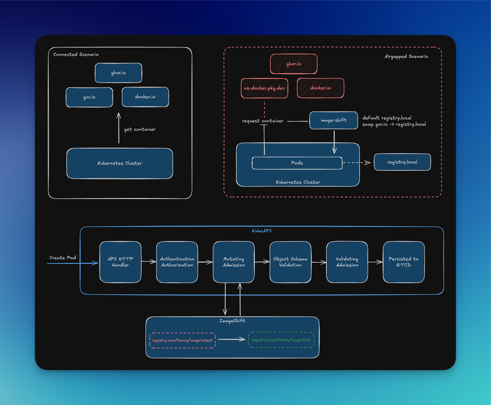

# ImageShift Webhook


<p align="left">
  
</p>


[](https://hub.docker.com/r/wcrum/webhook/)

There is a trend within airgapped environments administrators have to manually tag / re-tag images to allow their cluster to pull from a local registry.


This repository fixes all of that.

## ImageShift Architecture

ImageShift is a Kubernetes MutatingWebhook, the MutatingWebhook patches requests to / from the kube-apiserver. Based on your configuration, ImageShift will patch the image requested with whatever you have configured. 

What this means for you? Dont change your manifests, helm charts or refernces, keep them the same across the board. As you move your images from one domain to another, you dont have to worry about the manifests.



## Installation

### Pre-Requisites

1. Helm
2. ImageShift Container

### Helm Chart Install

```
helm install imageshift imageshift
```

#### Cert Manager (Optional)

MutatinWebhooks require for the KubeAPI Server to trust the service and Webhook. Cert Manager can be utilized for generation of self signed certificates or configuration based on Cert Manager issuers.


```
helm repo add jetstack https://charts.jetstack.io --force-update

helm install \
  cert-manager jetstack/cert-manager \
  --namespace cert-manager \
  --create-namespace \
  --version v1.16.1 \
  --set crds.enabled=true
```

### Prerequisites
- go version v1.23.0+
- docker version 17.03+.
- kubectl version v1.19+.
- Access to a Kubernetes v1.19+ cluster (mutating webhooks required).

### To Deploy on the cluster
**Build and push your image to the location specified by `IMG`:**

```sh
make docker-build docker-push IMG=<some-registry>/imageshift-v2:tag
```

**NOTE:** This image ought to be published in the personal registry you specified.
And it is required to have access to pull the image from the working environment.
Make sure you have the proper permission to the registry if the above commands don’t work.

**Install the CRDs into the cluster:**

```sh
make install
```

**Deploy the Manager to the cluster with the image specified by `IMG`:**

```sh
make deploy IMG=<some-registry>/imageshift-v2:tag
```

> **NOTE**: If you encounter RBAC errors, you may need to grant yourself cluster-admin
privileges or be logged in as admin.

**Create instances of your solution**
You can apply the samples (examples) from the config/sample:

```sh
kubectl apply -k config/samples/
```

>**NOTE**: Ensure that the samples has default values to test it out.

### To Uninstall
**Delete the instances (CRs) from the cluster:**

```sh
kubectl delete -k config/samples/
```

**Delete the APIs(CRDs) from the cluster:**

```sh
make uninstall
```

**UnDeploy the controller from the cluster:**

```sh
make undeploy
```

## Project Distribution

Following the options to release and provide this solution to the users.

### By providing a bundle with all YAML files

1. Build the installer for the image built and published in the registry:

```sh
make build-installer IMG=<some-registry>/imageshift-v2:tag
```

**NOTE:** The makefile target mentioned above generates an 'install.yaml'
file in the dist directory. This file contains all the resources built
with Kustomize, which are necessary to install this project without its
dependencies.

2. Using the installer

Users can just run 'kubectl apply -f <URL for YAML BUNDLE>' to install
the project, i.e.:

```sh
kubectl apply -f https://raw.githubusercontent.com/<org>/imageshift-v2/<tag or branch>/dist/install.yaml
```

### By providing a Helm Chart

1. Build the chart using the optional helm plugin

```sh
kubebuilder edit --plugins=helm/v1-alpha
```

2. See that a chart was generated under 'dist/chart', and users
can obtain this solution from there.

**NOTE:** If you change the project, you need to update the Helm Chart
using the same command above to sync the latest changes. Furthermore,
if you create webhooks, you need to use the above command with
the '--force' flag and manually ensure that any custom configuration
previously added to 'dist/chart/values.yaml' or 'dist/chart/manager/manager.yaml'
is manually re-applied afterwards.

## Contributing

We welcome contributions! Please see [CONTRIBUTING.md](CONTRIBUTING.md) for guidelines.

### Quick Start for Contributors

1. Fork and clone the repository
2. Run `make test` to verify the test suite passes
3. Create a feature branch and make your changes
4. Submit a pull request

**NOTE:** Run `make help` for more information on all potential `make` targets

More information can be found via the [Kubebuilder Documentation](https://book.kubebuilder.io/introduction.html)

## License

Copyright 2025.

Licensed under the Apache License, Version 2.0 (the "License");
you may not use this file except in compliance with the License.
You may obtain a copy of the License at

    http://www.apache.org/licenses/LICENSE-2.0

Unless required by applicable law or agreed to in writing, software
distributed under the License is distributed on an "AS IS" BASIS,
WITHOUT WARRANTIES OR CONDITIONS OF ANY KIND, either express or implied.
See the License for the specific language governing permissions and
limitations under the License.

