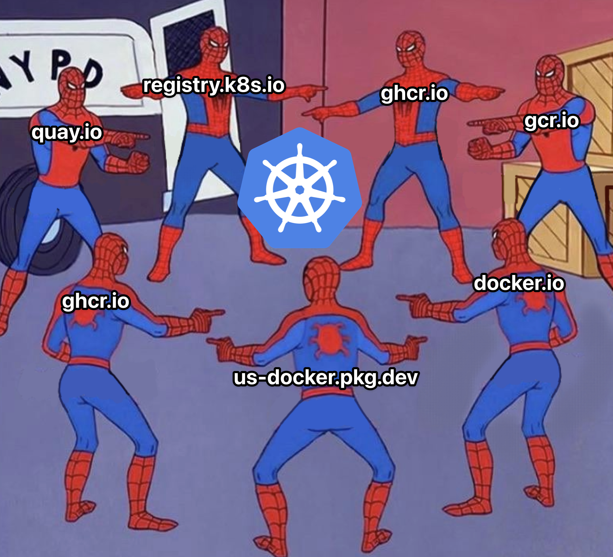

# ImageShift Webhook



[](https://hub.docker.com/r/wcrum/webhook/)

There is a trend within airgapped environments administrators have to manually tag / re-tag images to allow their cluster to pull from a local registry.


This repository fixes all of that.

## ImageShift Architecture

ImageShift is a Kubernetes MutatingWebhook, the MutatingWebhook patches requests to / from the kube-apiserver. Based on your configuration, ImageShift will patch the image requested with whatever you have configured. 

What this means for you? Dont change your manifests, helm charts or refernces, keep them the same across the board. As you move your images from one domain to another, you dont have to worry about the manifests.


## Installation

### Pre-Requisites

1. Helm
2. ImageShift Container

### Helm Chart Install

```
helm install imageshift imageshift
```

#### Cert Manager (Optional)

MutatinWebhooks require for the KubeAPI Server to trust the service and Webhook. Cert Manager can be utilized for generation of self signed certificates or configuration based on Cert Manager issuers.


```
helm repo add jetstack https://charts.jetstack.io --force-update

helm install \
  cert-manager jetstack/cert-manager \
  --namespace cert-manager \
  --create-namespace \
  --version v1.16.1 \
  --set crds.enabled=true
```

